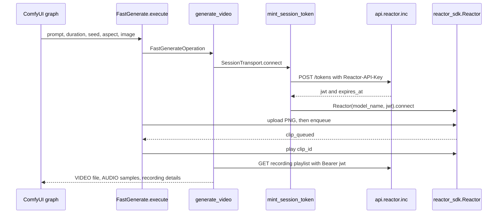

# How the Connector Unlocks Remote Reactor Generation

This page is for Reactor owners and Comfy Desk. It explains what the community
connector actually does so a ComfyUI graph can generate video on Reactor GPUs.
It follows one path: Load Image, Fast H3: Generate Video (Reactor), Save Video.

Setup, keys, and node inputs stay in the [setup guide](../README.md), the
[advanced guide](../ADVANCED.md), and the
[Fast H3 node guide](../web/docs/ReactorIncFastGenerate.md).

## Contents

- [The unlock](#the-unlock)
- [What you need before a run](#what-you-need-before-a-run)
- [How ComfyUI loads the nodes](#how-comfyui-loads-the-nodes)
- [Fast H3 image-to-video call flow](#fast-h3-image-to-video-call-flow)
- [Quoted call sites](#quoted-call-sites)
- [Where the key is stored](#where-the-key-is-stored)
- [How a session runs and stops](#how-a-session-runs-and-stops)
- [How the catalog is built](#how-the-catalog-is-built)
- [What Reactor provides and what this pack provides](#what-reactor-provides-and-what-this-pack-provides)
- [Limits](#limits)
- [Modules](#modules)

## The unlock

The pack is a thin ComfyUI client and a set of node adapters. It does not
download weights and it does not run the models. ComfyUI loads
`comfy_entrypoint` from `__init__.py`, which returns `ReactorExtension`. That
class registers nodes such as `FastGenerate` (`ReactorIncFastGenerate`). On a
run, the node encodes optional images, builds a `FastGenerateRequest`, and
`generate_video` opens one Reactor session. The only HTTP call this repository
makes with the API key is `mint_session_token`: `POST https://api.reactor.inc/tokens`
with the header `Reactor-API-Key`. The reply is a short-lived JWT.
`SessionTransport.connect` then creates `reactor_sdk.Reactor` for
`reactor/fast-h3` and sends model commands such as `enqueue` and `play` through
that SDK. Fast H3 returns a downloaded session recording. `node_output` turns
that file into ComfyUI `VIDEO` and `AUDIO` values. The graph's native Save Video
node writes the video output to disk.

## What you need before a run

| Requirement | Where it is set |
| --- | --- |
| Python 3.12 or later | `pyproject.toml` `requires-python` |
| ComfyUI 0.34.6 or later | `pyproject.toml` `requires-comfyui` |
| ComfyUI frontend 1.49.6 or later, still in 1.x | `requirements.txt` `comfyui-frontend-package` |
| `reactor-sdk` 1.4, below 1.5 | `requirements.txt` |
| Folder name `custom_nodes/reactor-inc` | [setup guide](../README.md) |
| A Reactor API key | Reactor settings, or `REACTOR_API_KEY` on the ComfyUI process |
| Credits on that Reactor account | Reactor. This pack only displays public rates. |

The settings window can save a key only from a local, single-user ComfyUI
window. A remote or multi-user server keeps the key in `REACTOR_API_KEY`.
Saving a key does not check it with Reactor. The first check is the token
request when a node runs.

## How ComfyUI loads the nodes

1. ComfyUI imports the `reactor-inc` package and calls `comfy_entrypoint` in
   `__init__.py`. The import of `ReactorExtension` waits until that call so
   host modules load only when the extension loads.
2. `ReactorExtension.on_load` builds a map from each node's `node_id` to a
   model key in `NODE_REGISTRATIONS`, then calls `initialize_runtime`. Fast
   H3's node class is `FastGenerate` and its model key is `fast-h3`.
3. `initialize_runtime` creates one process-wide `Runtime`: session admission,
   the browser-control registry, the private settings store, and the catalog
   store. It does not call the network.
4. `register_configuration` refuses to enable routes if the state directory
   sits inside ComfyUI's public folders or the package. It then registers
   settings, live-control, and catalog routes on `PromptServer.instance.routes`.
5. `ReactorExtension.get_node_list` returns the node classes. ComfyUI reads
   each `define_schema` for the canvas name, inputs, and outputs.
6. `WEB_DIRECTORY = "./web"` tells ComfyUI where the settings and model dialogs
   live.

`FastGenerate.define_schema` declares node id `ReactorIncFastGenerate`,
category `Reactor/Generate`, and outputs `video`, `audio`, and
`recording details`. Shared widgets come from `generation_controls`: scene
prompt, video duration, seed, and run number. Fast H3 adds aspect ratio plus
optional starting and final images.

Run number is a ComfyUI cache breaker. `FastGenerate.execute` discards it.
Reactor never sees it.

## Fast H3 image-to-video call flow

The example graph is Load Image, then `ReactorIncFastGenerate`, then ComfyUI's
native Save Video. Text-only runs skip Load Image. The same node accepts an
optional final image.



The numbered path below is the contract. The diagram is only a map.

1. `FastGenerate.execute` encodes each connected image with `encode_png`.
   The tensor must be one RGB image. The PNG bytes go into
   `FastGenerateRequest` with the prompt, duration, seed, and aspect.
   `wait_for_execution` polls ComfyUI interruption while that work runs.
2. `generate_video` reads `ConfigurationStore.execution_snapshot`. That
   snapshot is the settings and the credential for this run. A later settings
   save does not change a session that already started.
   `FastGenerateOperation.validate` checks prompt length, duration, seed,
   aspect, and upload size before any network call.
3. `SessionAdmission.slot` admits one session. The default capacity is 1.
   Other runs wait up to the queue timeout.
4. `SessionReservation.protect` writes a private deadline in `session.json`
   before connecting. If disconnect is not confirmed, the next run waits out
   that deadline.
5. `capture_video` builds `SessionTransport` with
   `FastGenerateOperation.connection_name`, which is `reactor/fast-h3` from
   `MODEL_IDENTITIES`.
6. `SessionTransport.connect` calls `mint_session_token` once. The request is
   `POST https://api.reactor.inc/tokens` with header `Reactor-API-Key`. The
   JSON `authorization_details` entry has type `session`, matches one model
   name, and sets `max_sessions` to 1. For Fast H3 the model name is
   `reactor/fast-h3`. `session_seconds` is the configured maximum session
   duration, not the clip length. `expires_after` adds
   `SESSION_EXPIRY_BUFFER_SECONDS` (120). The reply must contain a JWT and an
   `expires_at` that covers the session. A failed reply becomes a generic
   authorization error. The key is dropped after the mint. The SDK receives
   the JWT only.
7. `SessionTransport.connect` then constructs
   `Reactor(model_name=self.model, jwt=self.token.value)` and awaits
   `connect()`. Command and media transport after this point belong to
   `reactor-sdk`. This repository calls `send_command`, `upload_file`,
   `request_recording`, and track callbacks. It does not publish the
   signaling URL. The quoted call sites are below.

8. `capture_video` requires exactly one receive-only track named `main_video`.
   Frames are copied into a local encoder so the run can see that playback
   started. Fast H3 also requires one receive-only `main_audio` track.
9. `FastGenerateOperation.begin_generation` sends these commands through
   `SessionEvents.command_reply` and `Transport.send_command`:
    - `set_autoplay` with `{"enabled": False}`
    - `set_flush_on_clip_end` with `{"enabled": False}`
    - `set_canvas` with `{"aspect": <aspect>}`
    - `get_state` with `{}`
   The state payload must include `clip_seconds_min` and `clip_seconds_max`.
   The requested duration has to sit inside that range.
10. Optional images are uploaded before the clip is queued.
    `FastGenerateOperation._queue_clip` sends `enqueue` with `prompt`,
    `seconds`, and `seed`. `starting_frame` and `ending_frame` are added only
    when that image exists. Each value is the object returned by
    `transport.upload_file` for `input.png`, not the raw PNG. The accepted
    reply type is `clip_queued`. `read_clip` requires a UUID
    `clip_id`, a boolean `ready`, and a duration that matches the frame count
    at 24 frames per second. The accepted duration must also fit the capture
    limit.
11. The node waits for `clip_generated`, then sends `play` with
    `{"clip_id": <id>}`. Playback must report an end time that matches the
    accepted clip length within one frame. That interval becomes
    `RecordingWindow`.
12. Saving the end of the clip needs one extra queued clip. The connector
    sends another `enqueue` with the same prompt and seed, `seconds` set to
    the model's maximum clip length, and `continue_from_clip_id` set to the
    first clip. It plays that tail only so the recording fragment that holds
    the first clip's end can close. The saved window stays the first clip.
    The tail is not part of the ComfyUI output. It still uses session time
    and credits.
13. Because `requires_audio` is true, `SessionTransport.save_recording` asks
    the SDK for the session recording and passes `clip.playlist_url` to
    `download_recording`. The session JWT is sent as
    `Authorization: Bearer <jwt>` only when the URL's origin is
    `https://api.reactor.inc`. Fragment URLs may point at the reviewed storage
    origins in `RECORDING_STORAGE`, and those requests do not resend the token.
    Redirects are refused.
14. `prepare_recording` trims that download to `RecordingWindow` and writes an
    MP4 plus a WAV. `node_output` returns
    `InputImpl.VideoFromFile` for the video socket, decoded samples for the
    audio socket, and a JSON string of recording details. Connect the video
    socket to ComfyUI's Save Video node. This pack does not implement Save
    Video. The temporary MP4 lives in ComfyUI's temp directory under the
    prefix `reactor-` until Save Video or another consumer keeps it.

A rejected command is not retried. `SessionEvents.on_error` stops the session
on the first failure.

## Quoted call sites

These are the HTTP and SDK calls on the Fast H3 path. They are copied from
the current source.

`src/execution/authentication.py` `mint_session_token` posts the API key:

```python
session.post(
    SESSION_ENDPOINT,
    json=request_body,
    headers={"Reactor-API-Key": credential.reveal()},
    allow_redirects=False,
)
```

`SESSION_ENDPOINT` in `config/security.py` is `https://api.reactor.inc/tokens`.
The body in the same function is:

```python
request_body = {
    "expires_after": session_seconds + SESSION_EXPIRY_BUFFER_SECONDS,
    "authorization_details": [
        {
            "type": "session",
            "resources": {"models": {"match": [model]}},
            "constraints": {
                "max_sessions": 1,
                "max_session_duration_seconds": session_seconds,
            },
        }
    ],
}
```

`src/execution/transport.py` `SessionTransport.connect` opens the SDK with the
JWT and clears the API key first:

```python
self.token = await mint_session_token(self.model, self.credential, self.session_seconds)
self.credential = None
# The token already carries the lifetime cap; the SDK must not mint a
# second token or keep an API key for recording downloads.
self.client = cast("Transport", Reactor(model_name=self.model, jwt=self.token.value))
for event, callback in self.handlers:
    self.client.on(event, callback)
await self.client.connect()
```

`src/execution/fast/generate.py` `FastGenerateOperation._queue_clip` sends the
clip:

```python
payload: dict[str, object] = {
    "prompt": self.prompt,
    "seconds": self.duration_seconds,
    "seed": self.inputs.seed,
}
for name, image in (("starting_frame", self.inputs.image), ("ending_frame", self.inputs.ending_image)):
    if image is not None:
        payload[name] = await events.call(
            "upload", transport.upload_file(image, name="input.png", mime_type="image/png")
        )
reply = await events.call("enqueue", transport.send_command("enqueue", payload))
```

`src/media/recording/download.py` `_headers` attaches the session JWT only for
the coordinator origin:

```python
return {"Authorization": f"Bearer {token.value}"} if coordinator_url(url) else {}
```

`src/comfy/execution.py` `node_output` is the handoff to ComfyUI's video type:

```python
return io.NodeOutput(InputImpl.VideoFromFile(str(result.path)), audio, metadata)
```

## Where the key is stored

`read_credential` checks the process environment first. If `REACTOR_API_KEY`
is set, that value is the key, including when it is empty or invalid. A saved
file is used only when the variable is absent.

The settings UI sends `{"api_key": "<key>"}` to `PUT /reactor-inc/v1/credential`.
`ConfigurationRoutes.credential` stores it through `ConfigurationStore.save_credential`
and `save_credential`, which writes the file `credential` under the private
state directory. The status payload reports `environment`, `saved`, or
`missing`. It never returns the key. `DELETE /reactor-inc/v1/credential`
removes only the file.

`state_directory` picks the directory:

| Platform | Default path |
| --- | --- |
| macOS | `~/Library/Application Support/ReactorComfyUI` |
| Linux | `${XDG_STATE_HOME:-~/.local/state}/reactor-comfy` |
| Windows | `%LOCALAPPDATA%\ReactorComfyUI` |

`REACTOR_COMFY_STATE_DIRECTORY` can replace that path. It must be absolute and
outside the package and ComfyUI's input, output, temp, and user folders.
Files are owner-only where the platform supports it. They are not encrypted.

`local_route` and `require_local_request` wrap every settings, catalog, and
live route. The peer must be loopback, the host must be `localhost`,
`127.0.0.1`, or `::1`, and forwarding headers are rejected. Writes also
require header `X-Reactor-Comfy: 1` and a ComfyUI process that is not in
multi-user mode. A remote browser cannot save a key. Set
`REACTOR_API_KEY` on the server for that deployment.

Other local routes, all under `/reactor-inc/v1`:

| Method and path | Role |
| --- | --- |
| `GET /status` | Effective settings and key source |
| `PATCH /settings` | Save limits against the revision the editor read |
| `GET /catalog` | Saved public model list |
| `POST /catalog/refresh` | Fetch public prices and guides, then save them |
| `POST /catalog/rollback` | Restore the previous saved list |
| `POST /live/exchange`, `/live/action`, `/live/camera` | Browser controls for interactive nodes |

Fast H3 generate does not call the live routes.

## How a session runs and stops

`generate_video` is the shared owner for every model node. Fast H3 calls it
without `interactive=True`, so `prepare_interaction` returns no browser
session. The same function is what a headless ComfyUI API client can run.
Helios and the other live-prompt nodes pass `interactive` through. Webcam
nodes pass a `LiveOptions` object instead. Those modes need the browser that
submitted the prompt.

Cancellation uses ComfyUI's interrupt flag. `wait_for_execution` polls
`throw_exception_if_processing_interrupted` about every tenth of a second and
cancels the owned task. `finish_session` still disconnects the SDK and closes
the client. Closing a workflow tab does not cancel the run. If disconnect
does not finish inside the cleanup timeout, admission blocks new runs for the
maximum session duration so a billable session is not overlapped.

One ComfyUI process runs one Reactor session at a time
(`DEFAULT_SESSION_CAPACITY` is 1). A second process is refused by the
`session.lock` file.

Cache identity is `operation_fingerprint`. Fast H3's contract string is
`fast-queued-recording-v1` plus a private generation token that changes when
the effective key or execution limits change. Model-list refresh does not
change that token. Change run number to force a new ComfyUI execution when
the inputs are otherwise the same.

## How the catalog is built

Runnable models are hardcoded. `NODE_REGISTRATIONS` in `src/extension.py`
lists every node class and its model key. `MODEL_IDENTITIES` in
`config/models.py` lists the connection name sent to Reactor, the guide slug,
and live-control flags. Adding a price on the public list does not add a node.

`ModelStore` starts from that map. Before the first refresh, the model dialog
can already show models that have nodes. `read_public_models` refreshes
metadata with no API key:

| Source | URL |
| --- | --- |
| Prices | `https://api.reactor.inc/pricing` |
| Guide index | `https://docs.reactor.inc/llms.txt` |
| Navigation | `https://docs.reactor.inc/model-api-reference/overview` |

`model_views` joins those rows to the hardcoded nodes. A row with nodes is
`available`. A row with no node is `adapter_required`. Entries whose name or
slug starts with `happy-oyster` are dropped. Refresh writes
`catalog/catalog.json` under the private state directory and keeps one
previous snapshot for rollback. Automatic checks use the same public sources
and do not replace the saved list until someone chooses Refresh Models.

Your Reactor account, not this catalog, decides which connection names the
token endpoint will authorize.

## What Reactor provides and what this pack provides

| Reactor platform | This connector |
| --- | --- |
| GPUs, model weights, and generation | Node schemas, input checks, and command sequences |
| `POST /tokens` and the session JWT | `mint_session_token` and the `Reactor-API-Key` header |
| The model command channel inside `reactor-sdk` | `send_command` payloads for each adapter |
| Recording playlist and media bytes | Download, trim, and ComfyUI `VIDEO` / `AUDIO` outputs |
| Account access and credit charges | Public rate display and a local credit calculator |
| Public pricing and model guides | Which of those models have a node in this install |

The unlock is the client and the adapters. Shipping this folder does not ship
Fast H3.

## Limits

- Fast H3 is a queued clip. `FastGenerate.execute` never opens live controls.
  Prompt changes during the run are a Helios, LongLive, Visko, SANA, or X2
  behavior. This pack has no Turbo model in `MODEL_IDENTITIES`. A public Turbo
  or other unnamed model stays `adapter_required` until an adapter exists.
- Image batches are rejected. `encode_png` accepts one RGB frame. Load Image
  should feed a single picture.
- Clip length is about 5.167 to 14.375 seconds. Fast H3 may accept a nearby
  supported length. The saved duration is the accepted length, not always the
  typed number.
- The extra tail clip is required to close the recording and is omitted from
  the file you save. It still consumes session time.
- A Cloud Partner allowlist is not implemented here. This repository never
  reads one. `mint_session_token` asks Reactor for `reactor/fast-h3` only.
  Reactor accepts or rejects that account. Catalog refresh cannot grant access.
- The connector runs one session at a time and does not retry a rejected or
  uncertain command.
- HappyOyster is filtered out of the catalog and has no node.
- Remote ComfyUI cannot use the settings UI to store a key. Use
  `REACTOR_API_KEY`.
- The SDK's signaling and media URLs are outside this repository. Review
  `reactor-sdk` 1.4 for that transport. The HTTP call sites owned here are
  `mint_session_token`, `read_public_models`, and `download_recording`.

## Modules

| Module | Role |
| --- | --- |
| `__init__.py` `comfy_entrypoint` | ComfyUI extension entry. Returns `ReactorExtension`. |
| `src/extension.py` `ReactorExtension` | Registers nodes, runtime, and local routes. |
| `src/nodes/fast/generate.py` `FastGenerate` | Canvas node `ReactorIncFastGenerate`. |
| `src/nodes/controls.py` `generation_controls` | Shared prompt, duration, seed, and run-number widgets. |
| `src/execution/fast/generate.py` `FastGenerateOperation` | Fast H3 command sequence, including enqueue and play. |
| `src/execution/fast/clip.py` `read_clip` | Checks `clip_queued` and clip lifecycle messages. |
| `src/comfy/execution.py` `generate_video` | Admission, capture, cancellation, and ComfyUI outputs. |
| `src/execution/session/capture.py` `capture_video` | Connects, captures, downloads audio recordings, and cleans up. |
| `src/execution/transport.py` `SessionTransport` | Mints the JWT and wraps `reactor_sdk.Reactor`. |
| `src/execution/authentication.py` `mint_session_token` | `POST /tokens` with `Reactor-API-Key`. |
| `src/credentials.py` `read_credential` | Environment key, then the private `credential` file. |
| `src/settings/routes.py` `ConfigurationRoutes` | Local settings and key routes. |
| `src/http/security.py` `require_local_request` | Loopback and anti-proxy checks. |
| `src/discovery/sources.py` `read_public_models` | Unauthenticated price and guide fetch. |
| `config/models.py` `MODEL_IDENTITIES` | Hardcoded connection names, including `reactor/fast-h3`. |
| `src/media/recording/download.py` `download_recording` | Bearer download of the session recording. |
| `src/media/recording/assemble.py` `prepare_recording` | Trims the recording into the MP4 and WAV ComfyUI returns. |
